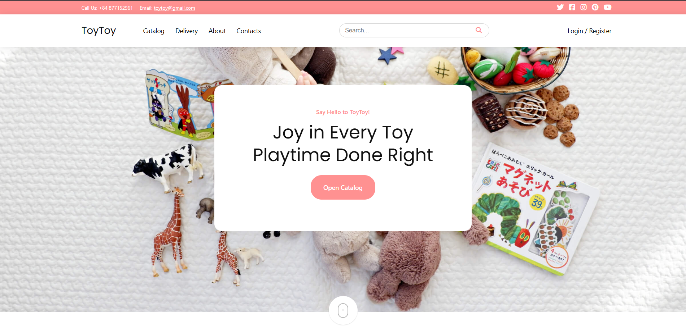
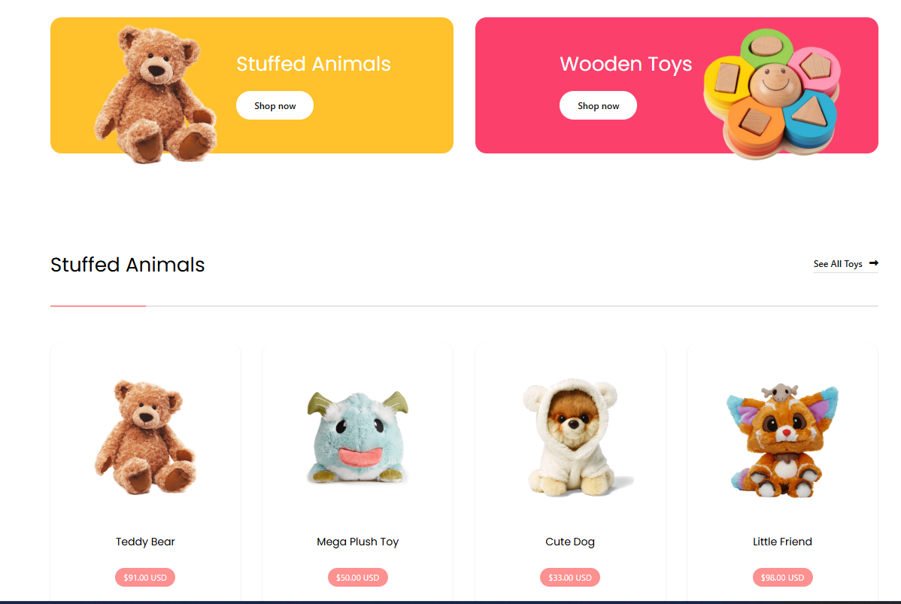
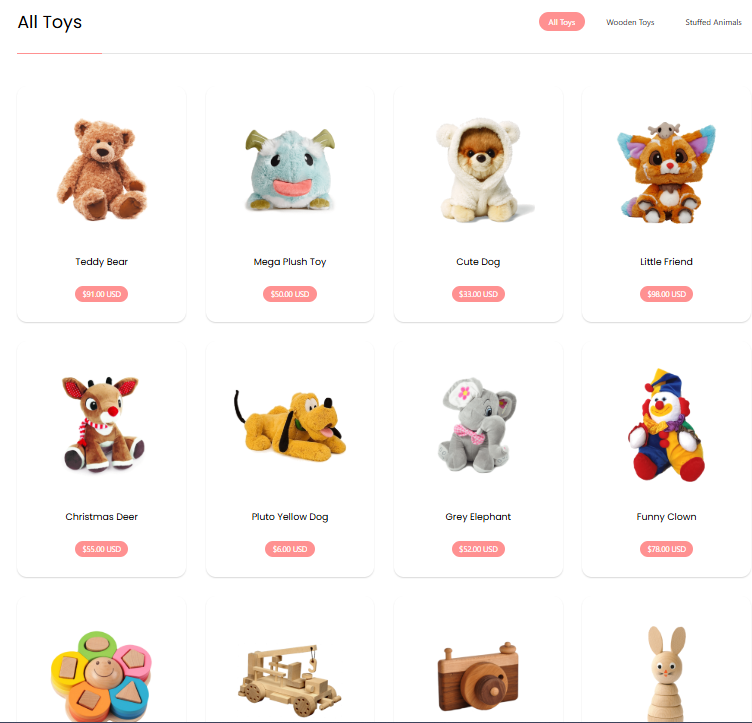
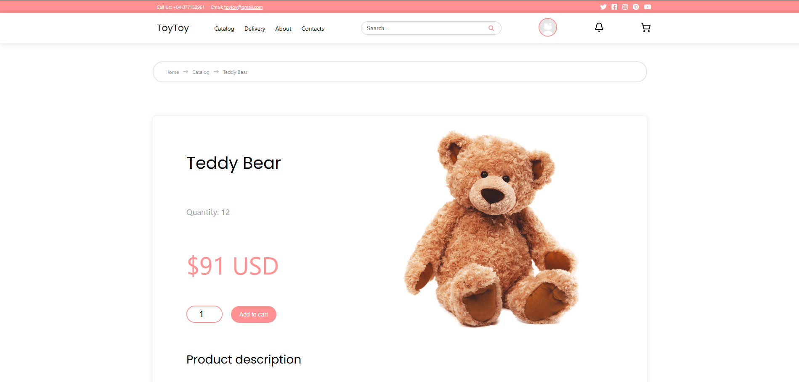
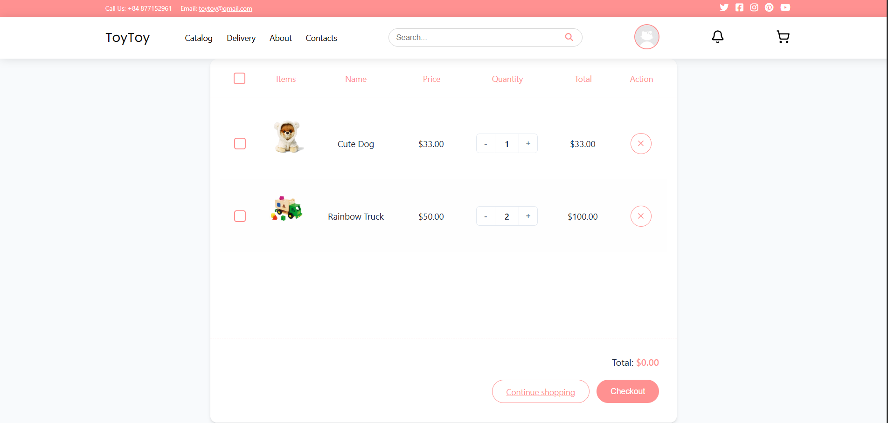

# 🧸 ToyToy – Children Toy E-commerce Website (Frontend)

**ToyToy** is a modern e-commerce web application for selling toys for children, focusing on a friendly UI, smooth shopping experience, and scalable frontend architecture.  
The project is built with a **feature-based structure** to ensure maintainability, reusability, and easy extension as the product grows.

---

## ✨ Key Highlights

- Feature-based frontend architecture
- Clean and reusable UI components
- State management with Redux Toolkit
- Scalable folder structure for real-world projects
- Responsive design for children-friendly e-commerce
- Ready for integration with backend APIs

---

## 🛠 Tech Stack

| Technology | Purpose |
|-----------|---------|
| **React** | Component-based UI development |
| **TypeScript** | Type safety and better maintainability |
| **Redux Toolkit** | Global state management |
| **React Router** | Client-side routing |
| **Axios / Services layer** | API communication |
| **CSS / UI Components** | Styling and layout |

---

## 🧱 Architecture Overview

The frontend follows a **Feature-based Architecture**, where each business feature is self-contained.

- **UI Components** are reusable and shared across features
- **Features** encapsulate business logic, state, services, and types
- **Pages** represent route-level screens
- **Store** manages global application state

This approach helps the project scale without becoming tightly coupled.

---

## 📂 Project Structure

```
src
├── assets
│   └── images                # Static assets (images, banners)
├── components
│   ├── common                # Reusable common components (Button, Modal)
│   ├── layouts               # Layout components (Header, Footer, MainLayout)
│   └── ui                    # UI sections (Loading, Breadcrumb, Sections)
├── features                  # Business features (domain-based)
│   ├── cart_items
│   │   ├── components
│   │   ├── services
│   │   ├── slice
│   │   └── types
│   ├── products
│   │   ├── components        # ProductCard, ProductDetail
│   │   ├── hooks
│   │   ├── services
│   │   ├── slice
│   │   └── types
│   └── users
│       ├── components        # UserProfile
│       ├── hooks
│       ├── services
│       ├── slice
│       └── types
├── hooks                     # Global custom hooks
├── pages                     # Route-level pages
├── routes                    # Route configuration
├── services                  # Shared API services
└── store
    ├── slices                # Global Redux slices
    └── types                 # Global state types
```
---

### 🖼️ Application Screenshots
Screenshots below demonstrate the main UI and features of ToyToy.

#### 🏡 Home

<p align="center">
  
</p>

<p align="center">
  
</p>

#### 🧸 Product Catalog

<p align="center">
  
</p>

<p align="center">
  
</p>

#### 🛒 Shopping Cart

<p align="center">
  
</p>

---

### 🚀 Getting Started
1️⃣ Install Dependencies
```bash
npm install
```
2️⃣ Run Development Server
```bash
npm run dev
```
